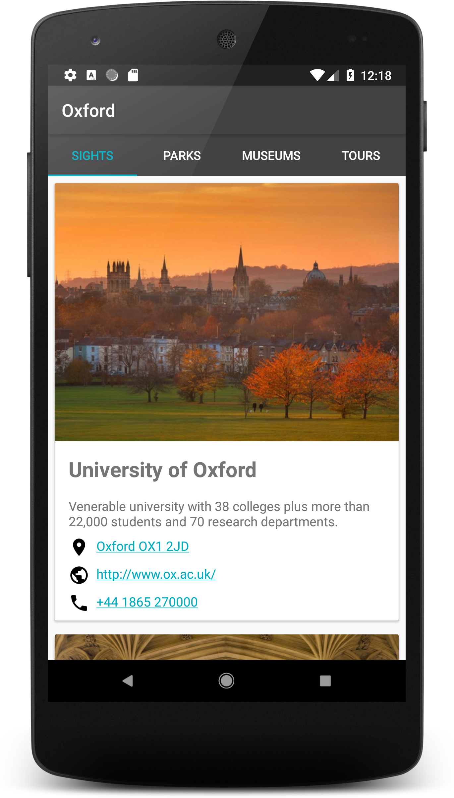
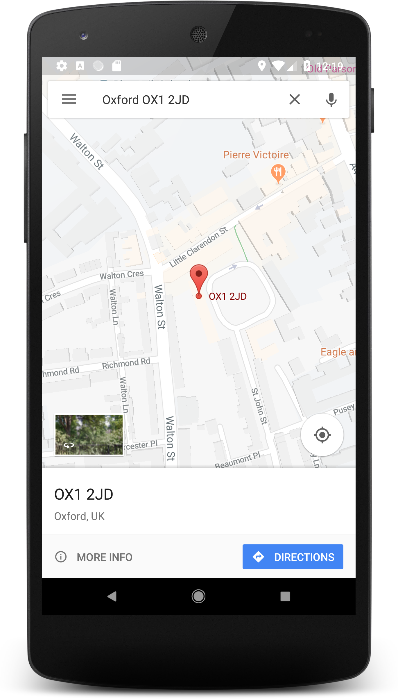
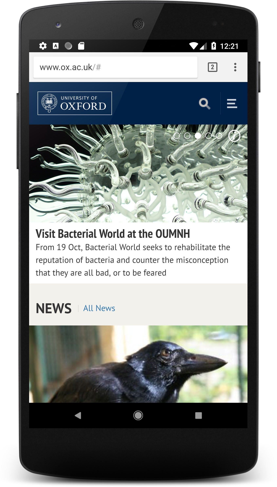

# Android Basics Nanodegree by Google | Udacity Project 6: Oxford Guide
A tour guide app that presents relevant attractions for a specific location.

Clicking the provided address will open Google Maps to that specific location: 

Clicking the specified web URL will open the related webpage:

